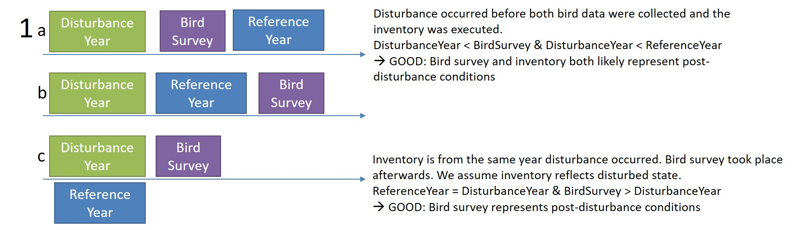
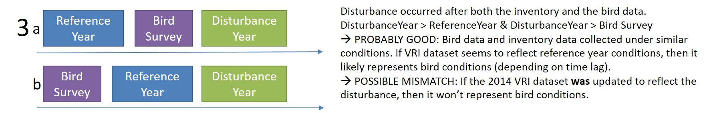

## Script Abstract


## Background
Bird data were collected any time between 1991 and the early 2010s. The VRI shapefile is from 2014. But we don't know when the photos were taken, or whether the time-dependent attributes were projected. 

There are plenty of opportunities for the bird data to be mis-matched with the forest attributes in the VRI data. 

In this script: 

* I explore the various date fields in the VRI dataset to determine how to calculate temporal alignment
* I calculate temporal alignment
* I filter out point counts I don't trust b/c of mis-alignment with VRI attributes


``` {r setup, echo=F, message=F, warning=F}
require(knitr)
opts_knit$set(root.dir = '..')
```

``` {r load.project, message=F}
require(ProjectTemplate)
load.project()
options(digits=12)
```

### Load intersected VRI file and look at dates

``` {r}
load("cache/intersect_both.RData")
vri_intersect <- intersect_both; rm(intersect_both)
```

### Possible dates to consider

* **input_date**: The date the forest cover information was entered into the Provincial Data Base.
* **interpretation_date**: The date on which the polygon estimates were photo interpreted.
* **attribution_base_date**: The date that the information about this polygon is considered to be based on. It is currently populated, however, it is ADVISABLE to use REFERENCE DATE attribute. (from VRI Relational Data Dictionary)
* **reference_date**: The date of the source data on which the interpretation is based. Known as the 'Reference Year' in the VIF file. In the VRI this is calculated from the year of the photo or source survey that was used to generate the VRI attribute.
* **projected_date**: The date to which time dependent stand information is projected. Used to determine the date to which time dependent variables in the stand have been projected. Attributes that are projected to a future date include: -Age, Age Class, Height, Height Class, Type Identity, Stocking Class, All maps within a project area should be projected to the same date.
* **earliest_nonlogging_dist_date**: Represents the polygons earliest non-logging disturbance date.
* **harvest_date**: The date in which the polygon was last harvested.

#### Look at the various dates

```{r}
vri_dates <- vri_intersect[c(grep(c("Year"), colnames(vri_intersect)), which(colnames(vri_intersect) %in% c("PROJ_AGE_1", "VRIintersectLayer", "EARLIEST_NONLOGGING_DIST_TYPE", "INTERPRETED_DATA_SRC_CD")))]

vri_dates <- vri_dates[order(vri_dates$VRIintersectLayer, vri_dates$PROJ_AGE_1),]

write.table(vri_dates, file="data/VRI_date_QC.csv", sep=",", row.names=F, col.names=T)

vri_dates_sample <- vri_dates[sample(1:nrow(vri_dates), 50),]

kable(vri_dates_sample, row.names=F)
```

**NOTES**

* PROJ_AGE_1 doesn't always correspond to difference between projected date and disturbance date. 
* Do I trust age? (not really)
    * Do I have much choice otherwise? (No)
* I met with Steve Cumming on Dec 19, 2017 to discuss my concerns. After looking at several instances, we concluded that sometimes data may not be updated after a given disturbance. This would explain some of the discrepancies. 
* Steve also points out that there are regeneration delays. A disturbance might have happened 50 years ago, but the stand is 45 years old. The forest didn't start regenerating until 5 years post harvest for some reason or another. 
* Decision: Deal with concerns over temporal alignment between bird observations and forest inventory data. Then deal with other concerns.

## Possible Scenarios of Alignment between Bird data, Inventory data, and Disturbance

There are three events: 

1. BAM survey conducted (bird observations)
2. Forest inventory data collected (indicated by 'reference year', the year that the underlying data - photo or field survey - are from)
3. Disturbance occurred (either harvest 'harvest_date' or nonlogging 'earliest_nonlogging_dist' or possibly not recorded in the inventory)

Scenarios. 


#### Further complication: time lag since reference year

Age, height, and other attributes are time-dependent. This text is from the VRIdata_userguide.pdf: "In many cases, the value for an attribute may need to be projected forward to a date other than at which it was originally recorded. Most attributes are not particularly time sensitive, and are simply carried forward unchanged. Altered attributes are primarily those based on age and height (i.e. timber volume), the latter of which is “grown” based on the derived site index. Note that there are no patterns of stand dynamics in the projection process, and that attributes such as % crown closure and percent occurrence of different species are left unchanged.

There are two main reasons for projecting the inventory: coordinating the entire inventory to a single time reference, and evaluating future forest conditions and values. The concept of the VRI as a “snapshot” inventory is somewhat misleading, as the base data may be derived from several different time periods (i.e. aerial photo dates, silviculture and inventory survey dates). Where it is necessary to evaluate the land base at a particular date, projected attributes are required. The date of interest may be the current date, some date in the future, or a sequence of dates in between."

Age of course can be projected reliably, assuming there hasn't been a disturbance in the intervening years. However, "Projected Height is determined by applying the Projected Age to various site index functions for the leading commercial species: a)- an ecologically based site index is used (e.g. mid- point of site class) for young stands (i.e. Projected Age less than 30 years). b)-site index functions are used to determine Projected Height for older stands (i.e. Projected Age greater than, or equal to, 30 years)."

The resulting projection will be as reliable as the model, so we perhaps have less confidence in the projected height as the time lag between inventory data (reference_year) and the bird survey date increases. 

##### Calculate the difference (in years) between BAM Survey year and VRI photo/reference year

**Merge the intersected VRI polygons with the point count survey information (pkey)**

``` {r}
birds <- read.csv("data/birddata_preprocess1.csv", header=T)
birdsurveys <- birds[c("PKEY", "SS", "YYYY")]
birdsurveys <- birdsurveys[!duplicated(birdsurveys),]

vri_birdsurveys <- merge(vri_intersect, birdsurveys, by="SS") #keep only bird surveys where I have forest stand info for)
``` 

**NOTE**

* Cutting out bird surveys that don't intersect the VRI dataset removes some bird surveys, particularly Atlas and BBS, which were done more coastal and on Vancouver island

**Calculate # years difference between the bird survey (YYYY) and the inventory date (ReferenceYear)**

``` {r Fig.Diff_BirdSurvey_VRIPhoto, fig.height=6, fig.width=9, dpi=200}
vri_birdsurveys$Difference_Bird_Photo <- vri_birdsurveys$YYYY - as.numeric(vri_birdsurveys$ReferenceYear)

ggplot(vri_birdsurveys, aes(x=Difference_Bird_Photo, fill=DisturbanceYear)) + geom_histogram(bins=40) + myfacettheme3 + ylab("Number of Point Count Surveys") + xlab("Difference (in years) between bird survey year and VRI Reference Year") + geom_vline(xintercept=0, linetype="dashed", color="red", size=1)
```

**NOTES**

* Many rows removed in the creation of that figure? Why? 
    * Canfor doesn't have REFERENCE_DATE or REFERENCE_YEAR. Will just have to trust that the dataset was updated recently and I don't need to worry about time lags between when inventory was done and the projected date. 

#### Replace canfor's ReferenceYear with the YYYY from the bird surveys, since I agreed to accept these dates. 

``` {r}
vri_birdsurveys[vri_birdsurveys$VRI_Layer == "Canfor_TFL",]$ReferenceYear <- vri_birdsurveys[vri_birdsurveys$VRI_Layer == "Canfor_TFL",]$YYYY
vri_birdsurveys$Difference_Bird_Photo <- vri_birdsurveys$YYYY - as.numeric(vri_birdsurveys$ReferenceYear) #recalculate difference between bird survey and reference year
```

### Cut out data if the time lag between bird survey and reference year is too great

**Make the definition of of "too great" dependent on stand age class**

``` {r}
vri_birdsurveys$AgeClass_calc <- ordered(vri_birdsurveys$AgeClass_calc)
unique(vri_birdsurveys$AgeClass_calc)

toleratedlags <- data.frame(AgeClass_calc=levels(vri_birdsurveys$AgeClass_calc), ToleratedLag=c(2, 5, 10, 20, 35, 50))
kable(toleratedlags, row.names=F)
```

##### Add tolerated lag to data.frame based on age class

``` {r}
vri_birdsurveys <- merge(vri_birdsurveys, toleratedlags, by="AgeClass_calc", all.x=T)
```

##### Manually change toleratedlag for known non-forested stands to 10 years. I want to include them, within reason

``` {r}
vri_birdsurveys[vri_birdsurveys$AgeClass_calc == "0-2 yrs" & (is.na(vri_birdsurveys$PROJ_AGE_1) == T),]$ToleratedLag <-10
```

##### Identify where lags exceed my tolerated
``` {r}
vri_birdsurveys$LagExceedsTolerated <- abs(vri_birdsurveys$Difference_Bird_Photo) > abs(vri_birdsurveys$ToleratedLag)
kable(rbind(
  head(vri_birdsurveys[c("Difference_Bird_Photo", "YYYY", "ReferenceYear", "AgeClass_calc", "ToleratedLag", "LagExceedsTolerated", "VRI_Layer")]), 
  tail(vri_birdsurveys[c("Difference_Bird_Photo", "YYYY", "ReferenceYear", "AgeClass_calc", "ToleratedLag", "LagExceedsTolerated", "VRI_Layer")])))
```

**NOTES**

* Number of bird surveys where difference between bird survey and inventory reference year exceeds acceptable lag: `r sum(vri_birdsurveys$LagExceedsTolerated)` of `r nrow(vri_birdsurveys)`, leaving `r nrow(vri_birdsurveys) - sum(vri_birdsurveys$LagExceedsTolerated)` surveys. 

##### Subset for those surveys within the tolerated lag

``` {r}
vri_birdsurveys2 <- vri_birdsurveys[vri_birdsurveys$LagExceedsTolerated == 0,]
vri_birdsurveys2$ReferenceYear <- as.character(vri_birdsurveys2$ReferenceYear)
```

## Eliminate the scenarios we may not trust, keeping only those we're pretty darn confident in

We have the three scenarios described above re: sequence in three events (bird survey, VRI inventory, and disturbance). But what do we do when no disturbance was recorded?

### First, work on subset of data where no disturbance was recorded

``` {r}
vri_bird_nodist <- vri_birdsurveys2[is.na(vri_birdsurveys2$DisturbanceYear),] #no disturbance recorded
vri_bird_dist <- vri_birdsurveys2[!is.na(vri_birdsurveys2$DisturbanceYear),]  #disturbance recorded
```

#### For stands with no recorded disturbance, do we believe the age, given the reference year?

``` {r Fig.ForestAge_NoDisturbance, fig.height=6, fig.width=9, dpi=200}
ggplot(vri_bird_nodist, aes(x=PROJ_AGE_1, fill=ReferenceYear)) + geom_histogram(bins=40) + myfacettheme3 + ylab("Number of Point Count Surveys") + xlab("Projected Stand Age (stands with no recorded disturbance)") + geom_vline(xintercept=c(0, 30, 80, 120, 250), col="red", linetype="dashed")  + annotate("text", label = "30 yrs", x = 32, y = 3950, size = 3, colour = "red") + 
  annotate("text", label = "80 yrs", x = 82, y = 3950, size = 3, colour = "red") +
  annotate("text", label = "120 yrs", x = 120, y = 3950, size = 3, colour = "red") +
  annotate("text", label = "250 yrs", x = 250, y = 3950, size = 3, colour = "red") +
  annotate("text", label = "0 yrs", x = 3, y = 3950, size = 3, colour = "red")
```

**NOTES**

* Many of the stands are indeed very old. 
* But some are projected to be quite young. 

**NextStep**

* Understand where the age estimate is coming from -- data_source_age_cd

``` {r}
t.agesrc <- as.data.frame(table(vri_bird_nodist$DATA_SOURCE_AGE_CD))
colnames(t.agesrc)[1] <- c("CODE")

agesrccd <- read.csv("data/LOOKUP.AgeDataSource.csv", header=T)
t.agesrc <- merge(agesrccd[c("CODE", "DESCRIPTION")], t.agesrc, by="CODE", all.y=T)
kable(t.agesrc, caption="Frequency of each source of age data within the polygons there is no disturbance record")
```

**NOTES**

* Projected age is estimated most frequently from photointerpretation. 
* `r nrow(vri_bird_nodist[is.na(vri_bird_nodist$DATA_SOURCE_AGE_CD),])` rows have no data source listed
    * `r sum(vri_bird_nodist[is.na(vri_bird_nodist$DATA_SOURCE_AGE_CD),]$VRI_Layer == "Canfor_TFL")` are from Canfor. 

**Decisions**

* I will accept any stand where there is a data source listed for age. 
* Of stands where there is no data source for age, I will accept Canfor ones.
* of Forsite stands without data source for age, I will keep any with a non-blank nonforest descriptor
* Of remaining rows/stands, I will keep any 200 yrs or older

``` {r}
nodist.discard.id <- vri_bird_nodist[is.na(vri_bird_nodist$DATA_SOURCE_AGE_CD),] # rows with no age data source
nodist.discard.id <- nodist.discard.id[nodist.discard.id$VRI_Layer == "Forsite_VRI",] # Discarding those from Forsite VRI
nodist.discard.id <- nodist.discard.id[nodist.discard.id$NON_PRODUCTIVE_DESCRIPTOR_CD %in% "",] #discarding stands if they don't have a non-forest code
nodist.discard.id <- nodist.discard.id[nodist.discard.id$PROJ_AGE_1 %in% c(0:199),] # discarding 'younger' stands
nodist.discard.id <- unique(nodist.discard.id$VRI.layer.polygon.ID)
```

##### create a reduced dataset where I trust the PROJ_AGE more or less, despite there being no record of disturbance

Keep only stands passing the above criteria. 
Note that I'm preserving on the stand basis, not bird survey basis. It's the stands that might be problematic here, not the relation to bird surveys. 

``` {r}
vri_bird_nodist <- vri_bird_nodist[!vri_bird_nodist$VRI.layer.polygon.ID %in% nodist.discard.id,]
```


### Second, work through the three major scenarios based on when disturbance happens

**Scenario subsets:**

1. **Scenario 1:** Disturbance happened before both bird survey and inventory
2. **Scenario 2:** Disturbance happened between bird survey and inventory year
3. **Scenario 3:** Disturbance happened after both bird survey and inventory year

##### Create three datasets to reflect the 3 major scenarios based on when disturbance occurs. 

Using the subset from above where there IS a value for disturbance. 

**Scenario 1**



``` {r}
vri_bird_dist$DisturbanceYear <- as.integer(vri_bird_dist$DisturbanceYear)
vri_bird_dist$ReferenceYear <- as.integer(vri_bird_dist$ReferenceYear)
vri_bird_dist$YYYY <- as.integer(vri_bird_dist$YYYY)
vri_bird_dist$ProjectedYear <- as.integer(vri_bird_dist$ProjectedYear)

vri_bird_scen1 <- subset(vri_bird_dist, 
  ((vri_bird_dist$DisturbanceYear < vri_bird_dist$YYYY) & 
  (vri_bird_dist$DisturbanceYear < vri_bird_dist$ReferenceYear)) |
  ((vri_bird_dist$ReferenceYear == vri_bird_dist$DisturbanceYear) &
  (vri_bird_dist$YYYY > vri_bird_dist$DisturbanceYear)))
```

**Scenario 2**


``` {r}
vri_bird_scen2 <- subset(vri_bird_dist, 
  ((vri_bird_dist$DisturbanceYear > vri_bird_dist$ReferenceYear) & 
  (vri_bird_dist$DisturbanceYear < vri_bird_dist$YYYY)) | 
  ((vri_bird_dist$DisturbanceYear > vri_bird_dist$YYYY) &
  (vri_bird_dist$DisturbanceYear < vri_bird_dist$ReferenceYear)) |
  ((vri_bird_dist$DisturbanceYear == vri_bird_dist$ReferenceYear) &
  (vri_bird_dist$YYYY < vri_bird_dist$ReferenceYear)) |
  ((vri_bird_dist$DisturbanceYear == vri_bird_dist$YYYY) &
  (vri_bird_dist$ReferenceYear > vri_bird_dist$DisturbanceYear)) | 
  ((all.equal(vri_bird_dist$ReferenceYear, vri_bird_dist$DisturbanceYear, vri_bird_dist$YYYY)))|
  ((vri_bird_dist$DisturbanceYear == vri_bird_dist$YYYY) &
  (vri_bird_dist$DisturbanceYear > vri_bird_dist$ReferenceYear))) 
```


**Scenario 3**


``` {r}
vri_bird_scen3 <- subset(vri_bird_dist, 
  ((vri_bird_dist$DisturbanceYear > vri_bird_dist$ReferenceYear) & 
  (vri_bird_dist$DisturbanceYear > vri_bird_dist$YYYY)))
```

**Check to make sure I've gotten all rows classed into a scenario**

* Note that I ran this code several times and modified my subsets accordingly until no rows remained in the below test

``` {r}
scenario.rownames <- c(row.names(vri_bird_scen1), row.names(vri_bird_scen2), row.names(vri_bird_scen3))
vri_bird_dist[!row.names(vri_bird_dist) %in% scenario.rownames,c("ReferenceYear", "DisturbanceYear", "YYYY")]
```

#### 1. Disturbance happened before both bird survey and inventory


We think we trust bird surveys in this scenario, so I'm not doing any purging at this point.

* `r nrow(vri_bird_scen1)` rows for `r length(unique(vri_bird_scen1$SS))` locations spanning `r min(vri_bird_scen1$YYYY)` to `r max(vri_bird_scen1$YYYY)`.

``` {r}
kable(rbind(head(vri_bird_scen1[c("SS", "ReferenceYear", "DisturbanceYear", "YYYY", "AgeClass_calc", "HeightClass_calc", "BecZone")]),
            tail(vri_bird_scen1[c("SS", "ReferenceYear", "DisturbanceYear", "YYYY", "AgeClass_calc", "HeightClass_calc", "BecZone")])), row.names=F)
```


#### 2. Disturbance happened between bird survey and inventory year


We generally distrust this scenario. There's a small subset that might be salvagable, but it will likely take more time / effort than it's worth. We'll exclude all of these surveys. 

* `r nrow(vri_bird_scen2)` rows for `r length(unique(vri_bird_scen2$SS))` locations spanning `r min(vri_bird_scen2$YYYY)` to `r max(vri_bird_scen2$YYYY)`.


#### 3. Disturbance happened after both bird survey and inventory year


We generally trust this scenario. There's a small subset that might be problematic, where the 2014 VRI dataset was updated to reflect the disturbance... causing a mismatch with the bird conditions. Here I check if I can identify any rows fitting this condition. 

* `r nrow(vri_bird_scen3)` rows for `r length(unique(vri_bird_scen3$SS))` locations spanning `r min(vri_bird_scen3$YYYY)` to `r max(vri_bird_scen3$YYYY)`.

##### Subset: looking for stands where the projected info reflects the post-disturbance conditions, despite the reference year theoretically being prior to disturbance

How would I identify these stands? 

* If the projected age is within 5 years of the disturbance

``` {r}
vri_bird_scen3$PostDisturbanceAge <- vri_bird_scen3$ProjectedYear - vri_bird_scen3$DisturbanceYear
range(vri_bird_scen3$PostDisturbanceAge)

range(vri_bird_scen3$PROJ_AGE_1)
```

Look at stands that are quite old
``` {r}
tmp <- vri_bird_scen3[vri_bird_scen3$PROJ_AGE_1 > 30, c("ReferenceYear", "DisturbanceYear", "ProjectedYear", "PostDisturbanceAge", "PROJ_AGE_1", "EARLIEST_NONLOGGING_DIST_TYPE")]
tmp <- tmp[order(tmp$PROJ_AGE_1, decreasing=T),]
kable(rbind(head(tmp), tail(tmp)))
```

* Looks like they were disturbed by insects (IBM is mountain pine beetle), but are still aged to their original stand age rather than post-insect outbreak. So can keep older stands, but I need to decide the threshold of young versus old. 

Look at younger stands
``` {r}
tmp <- vri_bird_scen3[vri_bird_scen3$PROJ_AGE_1 <= 30, c("ReferenceYear", "DisturbanceYear", "ProjectedYear", "PostDisturbanceAge", "PROJ_AGE_1", "EARLIEST_NONLOGGING_DIST_TYPE", "VRI_Layer")]
tmp <- tmp[order(tmp$PROJ_AGE_1, decreasing=T),]
kable(rbind(head(tmp), tail(tmp)))
```

* Looks like Projected age in Canfor stands were updated after disturbances. And we don't have a reference year for Canfor stands, so let's just exclude Canfor stands from Scenario 3. 

``` {r}
dist.scen3.discard.id <- unique(vri_bird_scen3[vri_bird_scen3$VRI_Layer == "Canfor_TFL",]$VRI.layer.polygon.ID)
vri_bird_scen3 <- vri_bird_scen3[!vri_bird_scen3$VRI.layer.polygon.ID %in% dist.scen3.discard.id,]
```

**NOTES**

* Now that Canfor stands were removed, the youngest stand is `min(vri_bird_scen3$PROJ_AGE_1)` `r min(vri_bird_scen3$PROJ_AGE_1)`, which is much older than the youngest stand would be if it was dated to the last disturbance. Therefore, we can keep all these remaining stands. 
* Not to mention that all of these stands were disturbed by IBM

**DECISIONS**

* Exclude Canfor stands from Scenario 3.
* Keep remaining Scenario 3 stands. 

### Recombine Various Scenarios

``` {r}
colstokeep <- colnames(vri_bird_nodist)
vri_bird_tempaligned <- rbind(vri_bird_nodist[colstokeep],
                              vri_bird_scen1[colstokeep],
                              vri_bird_scen3[colstokeep])
```

#### Quality-check for duplicates

``` {r}
vri_bird_tempaligned$VRI.layer.polygon.ID.PKEY <- paste(vri_bird_tempaligned$VRI.layer.polygon.ID, vri_bird_tempaligned$PKEY, sep=".")

duplicatedids <- vri_bird_tempaligned$VRI.layer.polygon.ID.PKEY[duplicated(vri_bird_tempaligned$VRI.layer.polygon.ID.PKEY)]

vri_bird_tempaligned[vri_bird_tempaligned$VRI.layer.polygon.ID.PKEY %in% duplicatedids, c("VRI.layer.polygon.ID.PKEY", "PKEY")]

```

#### Save dataset for future use

``` {r}
cache("vri_bird_tempaligned")
```

**NOTES**

* It appears that there are no duplicated bird survey/stand combinations after tearing apart the dataset and reassembling it. 

**CONCLUSIONS**

* For the time being, this will be my set of bird surveys used for subsequent analyses. I'll have to assume that the projected age and height will be sufficiently close to what the observed birds experienced that my models are meaningful.


**Next Steps**

* summarize the coverage of the various forest stand types with this temporally aligned dataset.

